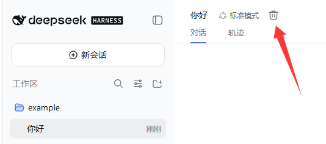
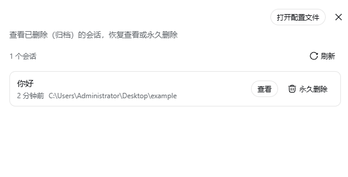

# dsh-session-admin

DSH 网页插件：会话管理。为会话增加**删除**入口，并在设置中提供**已归档的聊天**管理页，可查看 / 恢复 / 导出 / 永久删除。

## 功能

### 删除会话

会话标题栏会出现一个删除按钮（垃圾桶图标）。点击并确认后，会话被删除（移入归档，记录保留）。

删除走 DSH 运行时原生的归档通道（`workspace.archiveSession`），与官方「归档会话」菜单共用同一份状态，因此不会和其他插件冲突。



### 已归档的聊天管理

在 **设置 → 已归档的聊天** 中管理所有已删除（归档）的会话：



- **查看**：弹窗阅读完整会话记录 —— 用户 / 助手消息、工具调用（含参数）、工具结果（含失败标记）；工具名通过日志中的 `tool/call` 事件与 `tool/result` 关联。
- **恢复**：把会话移出归档，回到原工作区位置（走 workspace 存储域的原生状态写入，多标签页实时同步）。
- **导出**：导出为 Markdown（人类可读转写）或 JSONL（完整原始事件日志，每行一个事件）。
- **永久删除**：确认后移除持久化日志（文件级删除，不可撤销），并清理工作区账目、投影缓存与归档集合引用。

### 运行中判断

只有**正在运行**（agent 执行中，存在未闭合的 turn）的会话会被拒绝删除；空闲会话——包括本次运行中打开过、仍在内存里的——都可直接删除 / 恢复。「运行中」标记同样以 open-turn 判断，已停止的会话不会误报。

## 安装

```sh
dsh plugin --profile web add dsh-session-admin
```

插件通过 `dsh.bundle.patch` 追加到 profile 的 bundle 栈；该行是纯新增（不改写任何官方行），所以不会和其他插件或未来的 harness 升级冲突。

## 架构

- **Host 半**（`lib/index.js`）：挂载带防火墙的 `/session-manager/api/{list,read,restore,export,delete}` 路由（回环 / 可信主机校验，策略与官方 `/api` 网关和 dsh-better-sidebar 一致）。归档集合读自 `ctx.workspaceRegistry`，标题和会话表面读自 `ctx.sessionQuery`，持久化工件读自 `ctx.sessionPersistence`。永久删除先移除会话工件目录（这是 seam 没有删除 API 时约定的外部维护路径），再清理工作区账目、投影缓存行，最后移除归档集合引用；JSONL 后端下次列表时会重新发现目录布局，FTS 索引自行对账。
- **Client 半**（`lib/client.js`）：通过 slot 系统注册 `settings.section` 设置页和 `conversation.session.header.actions` 头部按钮（`ctx.slots.inject` 会等待声明方就绪）。不做 DOM 拦截、不替换服务、不改官方行。样式全部走 CSS Module 作用域和共享的 `--dsw-*` 主题变量；文案接入 DSH 语言包（中 / 英）。

## 构建

```sh
npm install     # 或 pnpm install（只需要 esbuild）
npm run build   # 生成 lib/index.js 和 lib/client.js
```

## 自测

仓库外随插件提供 `test-ui.mjs`，用 puppeteer-core + 系统 Chromium 驱动真实浏览器做端到端验收：删除按钮、归档、设置页归档列表、转写查看（含工具调用）、导出、恢复、永久删除、磁盘清理，以及与官方会话菜单和 `dsh-better-sidebar` 的共存。运行方式：

```sh
# 1. 用隔离的 DSH_HOME 启动测试实例（共享真实 profiles，隔离数据）：
#    $env:DSH_HOME=<temp-home>，把真实 profiles 目录 junction 到 <temp-home>/profiles
#    $env:DSH_HOME=...; dsh web --port 3099
# 2. node test-ui.mjs
```
